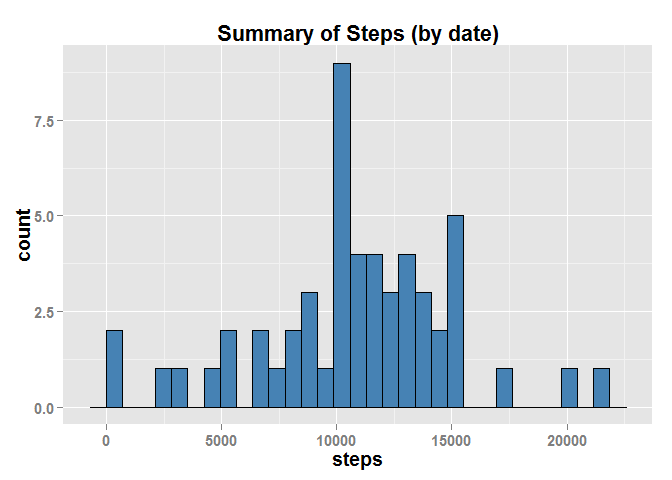
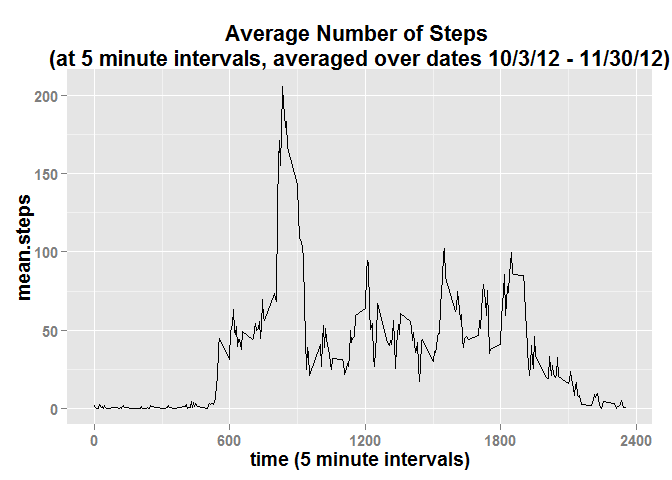
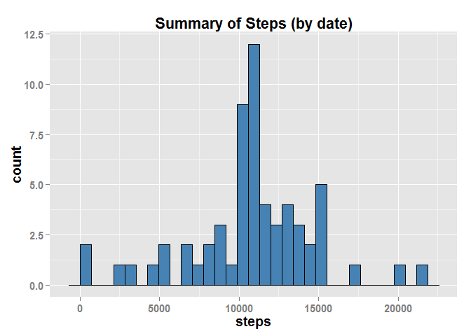
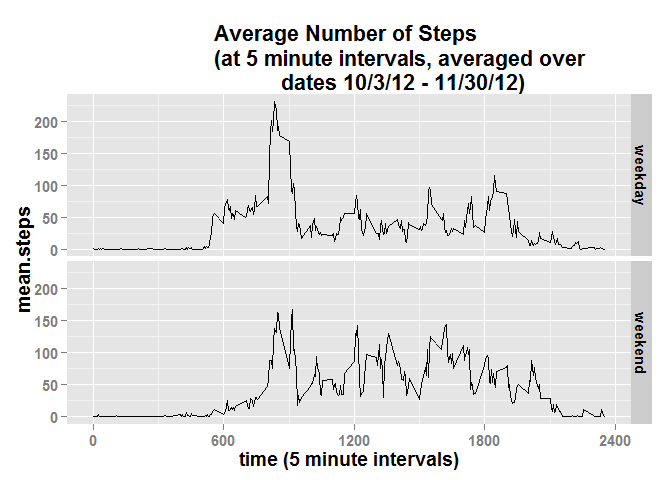

# Reproducible Research: Peer Assessment 1

## Loading and preprocessing the data


```r
library(lubridate)
library(ggplot2)
library(dplyr)
```

```
## 
## Attaching package: 'dplyr'
## 
## The following objects are masked from 'package:lubridate':
## 
##     intersect, setdiff, union
## 
## The following objects are masked from 'package:stats':
## 
##     filter, lag
## 
## The following objects are masked from 'package:base':
## 
##     intersect, setdiff, setequal, union
```

```r
library(data.table)
```

```
## 
## Attaching package: 'data.table'
## 
## The following objects are masked from 'package:dplyr':
## 
##     between, last
## 
## The following objects are masked from 'package:lubridate':
## 
##     hour, mday, month, quarter, wday, week, yday, year
```

```r
if (!file.exists("./data")) {
    dir.create("./data")
}
```

Download, unzip, and read in the data.  


```r
fileurl <- "https://d396qusza40orc.cloudfront.net/repdata%2Fdata%2Factivity.zip"
download.file(fileurl, destfile = "./data/repdata.zip", mode = 'wb')

read.zip <- function(file, ...) {
    zipFileInfo <- unzip(file, list=TRUE)
    if(nrow(zipFileInfo) > 1)
        stop("More than one data file inside zip")
    else
        read.csv(unz(file, as.character(zipFileInfo$Name)), stringsAsFactors = FALSE)
}

data <- read.zip("./data/repdata.zip")
```

Take a look at the data.


```r
str(data)
```

```
## 'data.frame':	17568 obs. of  3 variables:
##  $ steps   : int  NA NA NA NA NA NA NA NA NA NA ...
##  $ date    : chr  "2012-10-01" "2012-10-01" "2012-10-01" "2012-10-01" ...
##  $ interval: int  0 5 10 15 20 25 30 35 40 45 ...
```

```r
head(data)
```

```
##   steps       date interval
## 1    NA 2012-10-01        0
## 2    NA 2012-10-01        5
## 3    NA 2012-10-01       10
## 4    NA 2012-10-01       15
## 5    NA 2012-10-01       20
## 6    NA 2012-10-01       25
```

```r
summary(data)
```

```
##      steps            date              interval     
##  Min.   :  0.00   Length:17568       Min.   :   0.0  
##  1st Qu.:  0.00   Class :character   1st Qu.: 588.8  
##  Median :  0.00   Mode  :character   Median :1177.5  
##  Mean   : 37.38                      Mean   :1177.5  
##  3rd Qu.: 12.00                      3rd Qu.:1766.2  
##  Max.   :806.00                      Max.   :2355.0  
##  NA's   :2304
```

## What is mean total number of steps taken per day?

Explore the data...  
Convert to data.table. Sum steps by date.


```r
dt_data <- data.table(data) 
dt_data_bydate <- dt_data[ ,.(sum.steps=sum(steps)),by=date]
```

Plot histogram of total steps by date.


```r
a_bydate <- ggplot(dt_data_bydate, aes(sum.steps))
print(a_bydate + geom_histogram(fill=I("steelblue"), col=I("black")) + 
          xlab("steps") +
          ggtitle("Summary of Steps (by date)") +
          theme(text=element_text(size=14,face="bold")))
```

```
## stat_bin: binwidth defaulted to range/30. Use 'binwidth = x' to adjust this.
```

 

Calculate mean and median of total steps by day.


```r
bydate.mean <- mean(dt_data_bydate$sum.steps, na.rm = TRUE)
bydate.median <- median(dt_data_bydate$sum.steps, na.rm = TRUE)
print(bydate.mean)
```

```
## [1] 10766.19
```

```r
print(bydate.median)
```

```
## [1] 10765
```

## What is the average daily activity pattern?

Plot time series of the 5-minute interval (x-axis) and the average number 
of steps taken, averaged across all days (y-axis) calculate mean steps by 5-minute interval.


```r
dt_data_byinterval <- dt_data[ ,.(mean.steps=mean(steps, na.rm = TRUE)),by=interval]

a_byinterval <- ggplot(dt_data_byinterval, aes(interval, mean.steps))
print(a_byinterval + geom_line() + 
          scale_x_continuous(breaks=c(0,600,1200,1800,2400)) +
          xlab("time (5 minute intervals)") +
          ggtitle("Average Number of Steps 
(at 5 minute intervals, averaged over dates 10/3/12 - 11/30/12)") +
          theme(text=element_text(size=14,face="bold")))
```

 

Which 5-minute interval contains maximum average number of steps?


```r
dt_data_byinterval[ ,.(max=max(mean.steps)), by=interval][which.max(max),]
```

```
##    interval      max
## 1:      835 206.1698
```


## Imputing missing values

Calculate the total number of NA rows.


```r
sum(is.na(dt_data$steps))
```

```
## [1] 2304
```

Impute NA values...
I am using the mean number of steps by interval.
data.table continues to be the flow that works best for me, 
so I am sticking with it. (instead of dplyr)


```r
impute.mean <- function(x) replace(x, is.na(x), as.integer(mean(x, na.rm = TRUE)))

dt_data_imputed <- dt_data[, steps := impute.mean(steps), by = interval]
```

Sum steps by date.  Plot histogram of total steps by date.


```r
dt_data_imputed_bydate <- dt_data_imputed[ ,.(sum.steps=sum(steps)),by=date]

a_imputed_bydate <- ggplot(dt_data_imputed_bydate, aes(sum.steps))
print(a_imputed_bydate + geom_histogram(fill=I("steelblue"), col=I("black")) + 
          xlab("steps") +
          ggtitle("Summary of Steps (by date)") +
          theme(text=element_text(size=14,face="bold")))
```

```
## stat_bin: binwidth defaulted to range/30. Use 'binwidth = x' to adjust this.
```

 

Calculate mean and median of total steps by day.


```r
bydate.imputed.mean <- mean(dt_data_imputed_bydate$sum.steps, na.rm = TRUE)
bydate.imputed.median <- median(dt_data_imputed_bydate$sum.steps, na.rm = TRUE)
print(bydate.imputed.mean)
```

```
## [1] 10749.77
```

```r
print(bydate.imputed.median)
```

```
## [1] 10641
```

##Are there differences in activity patterns between weekdays and weekends?

Create a new factor variable with 2 levels "weekday" and "weekend"...
stick with data.table, again!
Convert date column to POSIXct class.


```r
dt_data_imputed[ , date.posixct := ymd(date)] -> dt_data_imputed_w_day
dt_data_imputed_w_day <- dt_data_imputed_w_day[ ,day.week := wday(date.posixct)] 
```

Create function to determine weekday and weekend...
data.table reference generation and use of function.


```r
day.of.week <- function(x) ifelse(x > 1 & x <7,"weekday", "weekend")
dt_data_imputed_w_daytype <- dt_data_imputed_w_day[ , type.of.day := day.of.week(day.week)]
```

Convert type.of.day to a factor.


```r
dt_data_imputed_w_daytype$type.of.day <- as.factor(dt_data_imputed_w_daytype$type.of.day)
```

Make a panel plot of the 5-minute interval (x-axis) and the average number of 
steps taken, averaged across all weekday days or weekend days (y-axis).  Calculate
mean by interval and type of day.  Create a panel plot.


```r
dt_data_imputed_byinterval <- dt_data_imputed_w_daytype[ ,.(mean.steps=mean(steps)), by=.(interval,type.of.day)]

a_w_daytype <- ggplot(dt_data_imputed_byinterval, aes(interval, mean.steps))
print(a_w_daytype + geom_line() + 
          facet_grid(type.of.day ~ . ) +
          scale_x_continuous(breaks=c(0,600,1200,1800,2400)) +
          xlab("time (5 minute intervals)") +
          ggtitle("Average Number of Steps 
                  (at 5 minute intervals, averaged over 
                  dates 10/3/12 - 11/30/12)") +
          theme(text=element_text(size=14,face="bold")))
```

 

